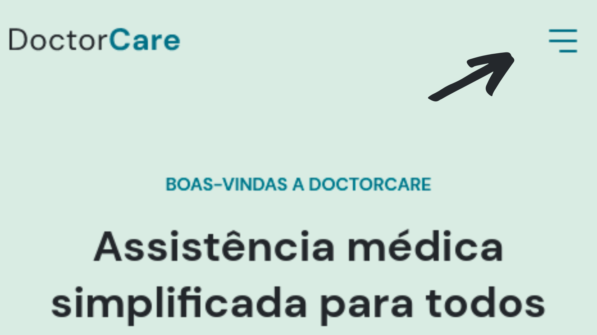
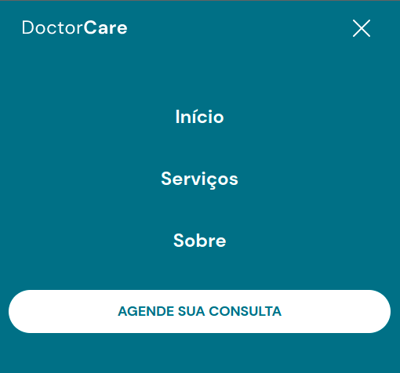
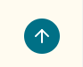

     
    </img>
     
    
Doctor Care, assistência médica onde você estiver!

     
    

# NLW:
<!--ts-->
   * [Sobre](#sobre)
   * [Navegar no website](#navegar)
   * [Como usar](#navegar)
      * [Demonstração da aplicação](https://dev-celo.github.io/NLW/)
      * [Remote files](https://github.com/dev-celo/NLW)
   * [Tecnologias](#tecnologias)
<!--te-->

# Sobre:

    

    O Doctor Care é uma página desenvolvida para uma clínica médica, onde apresentamos quais trabalhos essa clinica presta, qual local de atendimento, quais informações para contatos, exibimos profissionais e a clinica em uma foto no consultório, apresentando assim os responsáveis.
    

     
    

    Trabalho realizado com o pessoal da rocketseat onde aprendemos a criar uma página one-page, com o que há de moderno no desenvolvimento web até 2022.
    

# Navegar no site:

    <h2>Como navegar em nossa aplicação?</h2>
    

    Você pode ver os itens de navegação da nossa página clicando nos seguintes links (que se encontra na parte superior do site):
    

    </img>
     
    

    Se estiver utilizando uma tela menor, provavelmente você terá que abrir o menu(també na parte superior), que terá a seguinte aparência:
    

    </img>
     
    
E logo em seguida terá o seguinte resultado:

    </img>
     
    
Você pode entrar em contato com a clínica por meio do seguinte botão:

    </img>
    
Sempre que precisar voltar o topo basta clicar no seguinte botão: 

    </img>

   
   
   
  =========================================================
  <h2>✅ Javascript Select 🚀 Projeto concluído...  ✅</h2>
   
   

### Trabalho realizado com

  - [x] HTML5
  - [x] CSS3
  - [x] Javascript
   

  
Utilizamos em nosso projeto front-end as tecnologias HTML5, CSS3 e Js para fazer um layout responsivo de maneira a se adaptar em vários tamanhos de tela, usando os conceitos básicos do display flex para estruturar a página.
  Fizemos uso do DOM e do BOM para realizar as iterações com o usuário e manipular as informações para trazer resultados esperados.
  Tratamos de imagens em SVG manipulamos o path e alteramos cores e tamanhos de logo e algumas imagens.

  #### Olá me chamo Marcelo, fique à vontade para opinar :)
  
Se você chegou até aqui, muito obrigado por visitar esse perfil! Espero que tenha gostaddo do conteúdo.

  
  Você pode acessar a página [Clicando aqui](https://dev-celo.github.io/NLW/)

